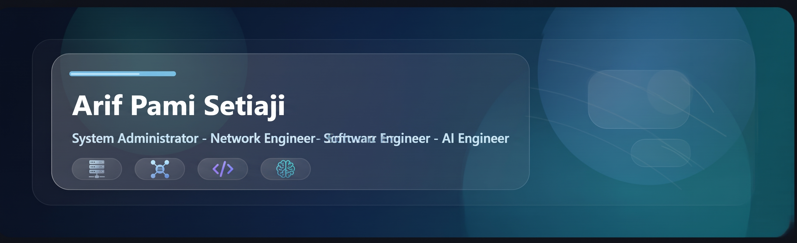

<!-- 1. Header Banner -->

  

<!-- 2. Deskripsi / Bio Singkat -->

  💻 Coding Enthusiast | 🎨 UI/UX | 🚀 SaaS Builder

<!-- 3. POSISI BADGE TECH STACK DI SINI -->
<h3 align="center">Tech Stack</h3>

  
  
  
  
  
  
  
  
  
  
  
  
  

---

## Currently Building

Building SaaS products, full stack applications, and internal tools with a focus on reliability and practical value.

---

## Cybersecurity Fundamentals

  🐉 Kali Linux | 🌐 Network Security | 📊 Wireless Security | 🔍 Vulnerability Assessment | 📡 Network Monitoring

